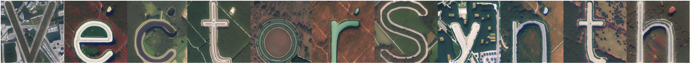

# VectorSynth: Fine-Grained Satellite Image Synthesis with Structured Semantics

<div align="center">


<!-- [](https://arxiv.org/pdf/2511.07744) -->
<!-- [](https://example.com) -->
<!-- [](https://huggingface.co/MVRL/VectorSynth) -->

[Daniel Cher*](https://dcher95.github.io/),
[Brian Wei*](),
[Srikumar Sastry](https://sites.wustl.edu/srikumarsastry/),
[Nathan Jacobs](https://jacobsn.github.io/)

(*Corresponding Author)
</div>

This repository is the official implementation of VectorSynth. VectorSynth is a suite of models for synthesizing satellite images with global style and text-driven layout control.


## 🤗 Models

[MVRL/VectorSynth](https://huggingface.co/MVRL/VectorSynth)
[MVRL/VectorSynth-COSA](https://huggingface.co/MVRL/VectorSynth-COSA)

## 📦 Dataset

Download from [Box](https://wustl.box.com/s/3cciborp260e0hrwvnw1jox2jmeyi4ym):
- `pixel_tensors/` - Rasterized OSM grids
- `tag_vocab.pt` - Tag vocabulary
- `taglist_vocab.pt` - Taglist vocabulary

See [dataset.md](scripts/data/dataset.md) for generating your own data from OpenStreetMap.

## 🌏 Inference

```python
from diffusers import StableDiffusionControlNetPipeline
pipe = StableDiffusionControlNetPipeline.from_pretrained("MVRL/VectorSynth")
```

See [inference.py](scripts/inference.py) for a complete example with hint processing.

## 🔬 COSA

For using COSA, see [cosa/README.md](scripts/cosa/README.md).

## 🧑‍💻 Setup and Training

Create a conda environment:

```bash
conda env create -f environment.yaml
conda activate vectorsynth
```

See [train.md](scripts/train.md) for training details.

## 📑 Citation

```bibtex
@inproceedings{cher2025vectorsynth,
  title={VectorSynth: Fine-Grained Satellite Image Synthesis with Structured Semantics},
  author={Cher, Daniel and Wei, Brian and Sastry, Srikumar and Jacobs, Nathan},
  year={2025},
  eprint={arXiv:2511.07744},
  note={arXiv preprint}
}
```

## 🔍 Additional Links

Check out our lab website for other interesting works on geospatial understanding and mapping:
* Multi-Modal Vision Research Lab (MVRL) - [Link](https://mvrl.cse.wustl.edu/)
* Related Works from MVRL - [Link](https://mvrl.cse.wustl.edu/publications/)
* See our previous work - [Link](https://github.com/mvrl/GeoSynth)
